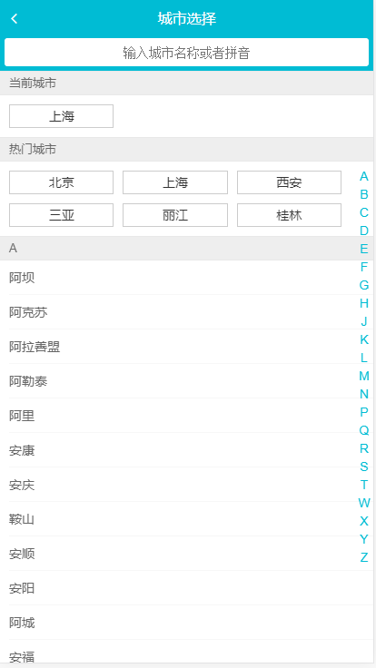

## 说明
极简易版的仿去哪儿移动端app,使用vue全家桶构建，非常适合初学者。简单的使用vuex和localStorage管理当前定位城市。
通过该项目可以快速入手vue, 了解到常见的移动端开发问题，例如1像素边框、移动端300ms点击延迟...

> 如果对您对此项目有兴趣，可以点 "Star" 支持一下 谢谢！

> 或者您可以 "follow" 一下，我会不断开源更多的有趣的项目

> 如有问题请直接在 Issues 中提，或者您发现问题并有非常好的解决方案，欢迎 PR 👍

> 开发环境: window10专业版; nodejs v10.16.3; vsCode

> 更多探索：[原生体验移动端音乐app(进阶vuex)](https://github.com/lumengxin/vue-music.git)    [中仿饿了么app](https://github.com/lumengxin/vue4-gshop.git)

### 技术栈

vue + vue-router + vuex + axios + vue-awesome-swiper + fastclick + better-scroll + stylus

### 项目运行

```
git clone https://github.com/lumengxin/Travel.git // 获取代码
cd Travel;npm i				// 安装依赖
npm run dev 或者 npm start   // 运行
npm run lint                // 格式化代码
npm run build               // 打包上线
```

### 更多阅读

[开发笔记](./docs/note.md)

## 项目预览：

[在线演示](http://www.byooka.com/v19/travel)

**效果展示：**

<div style="display:flex;flex-wrap:wrap;">
        
    
    
</div>


## 项目总结：

### 要点归纳

- 初步使用vue全家桶
- vuex 结合 本地存储 localStorage实现数据持久化
- stylus预处理器的使用
- better-scroll，fastclick等移动端开发必用的库

### 代码亮点

(1) home/HomeIcons.vue:

*一维数组处理为二维数据*

```
pages () {
  // debugger
  const pages = []
  this.list.forEach((item, index) => {
    // 将一维数组处理为二维数组
    const page = Math.floor(index / 8)
    if (!pages[page]) {
      pages[page] = []
    }
    pages[page].push(item)
  })
  return pages
}
```

(2) detail/DetailList.vue:

*递归组件的使用*

(3) city

*城市字母表左右联动效果*

## 自动化构建项目
### github actions部署到阿里云

1. 阿里云`创建SSH密钥对`，保存到电脑指定位置(xxx.pem)

2. 打开需要部署到阿里云的github项目，点击`setting - secrets - new secret`。

secret名称为SERVER_SSH_KEY(命名规范)，将xxx.pem中内容赋值，点击完成。

3. 项目下建立`.github/workflows/ci.yml`文件，填入内容：
```
name: Build app and deploy to aliyun
on:
  #监听push操作
  push:
    branches:
      # master分支，你也可以改成其他分支
      - master
jobs:
  build:

    runs-on: ubuntu-latest

    steps:
    - uses: actions/checkout@v1
    - name: Install Node.js
      uses: actions/setup-node@v1
      with:
        node-version: '12.16.2'
    - name: Install npm dependencies
      run: npm install
    - name: Run build task
      run: npm run build
    - name: Deploy to Server
      uses: easingthemes/ssh-deploy@v2.1.5
      env:
          SSH_PRIVATE_KEY: ${{ secrets.SERVER_SSH_KEY }}
          ARGS: '-rltgoDzvO --delete'
          SOURCE: dist # 这是要复制到阿里云静态服务器的文件夹名称
          REMOTE_HOST: '118.190.217.8' # 你的阿里云公网地址
          REMOTE_USER: root # 阿里云登录后默认为 root 用户，并且所在文件夹为 root
          TARGET: /root/node-server # 打包后的 dist 文件夹将放在 /root/node-server
```


